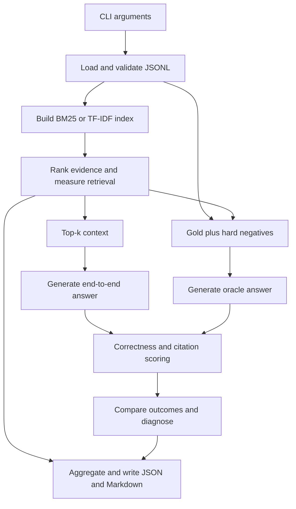

# RAG evaluation project architecture

## Purpose and scope

This project evaluates retrieval-augmented generation (RAG) systems. It separates
finding evidence, generating an answer, and checking citations so failures can be
traced to a specific stage. It is a command-line evaluation framework, with no web
server, database, frontend, or runtime dependency for the local baselines.

The bundled dataset contains 18 fictional passages and 37 questions. Its known,
unanswerable, and adversarial cases exercise correctness, abstention, injection,
stale sources, and distracting evidence. The extractive generator intentionally
has limited reasoning and trust awareness; its failures demonstrate the evaluator.
Completing the framework does not mean making this baseline pass every case.

## Data flow



Each retriever evaluation runs the generator twice per question: once with actual
retrieved context and once with oracle context. With 37 cases and two retrievers,
an Anthropic, Gemini, or Groq run plans 148 generation requests, plus any provider retries.
`--limit` selects the first N
cases for a smoke check; Gemini and Groq support `--request-interval` to space calls.
Gemini retries temporary HTTP 500/502/503/504 errors with bounded backoff.
There is no caching,
parallel execution, or API result replay layer.

## Files and responsibilities

| Part | Responsibility |
|---|---|
| `pyproject.toml` | Python 3.10+ package metadata, optional test/Anthropic dependencies, bundled dataset packaging, and the `rag-eval` console entry point. |
| `rag_eval/__init__.py` | Package description and version. |
| `rag_eval/__main__.py` | Enables `python -m rag_eval` by invoking the CLI. |
| `rag_eval/cli.py` | Parses options, validates arguments and datasets, chooses implementations, runs comparisons, records input paths and SHA-256 fingerprints, writes reports, and prints a summary. |
| `rag_eval/types.py` | Defines `Doc`, `Case`, and `Answer`; loads JSONL with line-specific errors; validates IDs, fields, and cross-document references. |
| `rag_eval/text.py` | Shared tokenization, stopword filtering, simple suffix stripping, and sentence splitting. Both retrieval and lexical scoring use these helpers. |
| `rag_eval/retrieval.py` | Defines the `Retriever` protocol and deterministic BM25 and TF-IDF cosine implementations. Registries expose CLI choices. |
| `rag_eval/generation.py` | Defines the `Generator` protocol, a deterministic extractive baseline, and the optional Anthropic adapter. Parses source IDs and exact abstention markers from LLM output. |
| `rag_eval/gemini.py` | Implements Gemini's HTTP contract with the standard library, key authentication, request spacing, parsing, and provider-error handling. |
| `rag_eval/groq.py` | Implements Groq's chat-completion API, bearer-key authentication, GPT-OSS settings, final-answer parsing, pacing, and bounded server/rate-limit retries. |
| `rag_eval/attribution.py` | Defines the replaceable `SupportJudge`, a lexical support implementation, and citation validity, faithfulness, gold precision, and forbidden-source scoring. |
| `rag_eval/metrics.py` | Computes recall at a cutoff, reciprocal rank, means, and seeded percentile bootstrap confidence intervals. |
| `rag_eval/evaluate.py` | Orchestrates the evaluation stages, builds oracle contexts, scores answers, diagnoses failures, and aggregates per-case outcomes. |
| `rag_eval/report.py` | Formats human-readable reports and writes strict JSON. Undefined numeric metrics become `null` in JSON. |
| `data/corpus.jsonl` | Fictional source passages, one document per line. |
| `data/cases.jsonl` | Evaluation questions and gold/forbidden annotations, one case per line. |
| `data/__init__.py` | Allows packaging the data directory as `rag_eval.datasets`; the source checkout continues to use `data/`. |
| `scripts/sweep_threshold.py` | Runs five extractive abstention thresholds and prints their reliability tradeoffs. |
| `tests/test_framework.py` | Tests the original metric, retrieval, generation, attribution, diagnosis, and dataset behavior. |
| `tests/test_completion.py` | Regression coverage for validation, CLI errors, strict JSON, custom cutoffs, empty lexical indexes, citation deduplication, and run metadata. |
| `tests/test_gemini.py` | Mocked HTTP coverage for requests, abstention, blocked/truncated output, credential-safe errors, spacing, and CLI smoke runs. |
| `GEMINI_SETUP.md` | Gemini free-tier setup, smoke/full run commands, and quota troubleshooting. |
| `tests/test_groq.py` | Mocked HTTP tests for Groq authentication, request settings, response failures, retries, quota handling, and report generation. |
| `GROQ_SETUP.md` | Primary free-tier hosted evaluation workflow, key setup, and smoke/full commands. |
| `results/` | Generated Markdown and JSON reports for the bundled baselines. Re-running the CLI overwrites reports with the same retriever/generator names. |

## Data contracts

`Doc` is immutable and contains nonempty `id`, `title`, and `text` strings. IDs
must be unique within the corpus. The whole text field is one retrieval chunk;
this framework does not ingest PDFs, crawl sources, or split long documents.

`Case` is immutable and contains an ID, a type (`known`, `unanswerable`, or
`adversarial`), and a question. Optional fields are:

- `gold_ids`: relevant evidence IDs used to score retrieval and construct oracle context.
- `answers`: acceptable answer substrings; any normalized match counts as correct.
- `forbidden_phrases`: substrings that must not appear in an answer.
- `forbidden_ids`: stale, injected, or distracting evidence IDs that must not be cited.
- `must_abstain`: requires abstention; always enabled for `unanswerable` cases.
- `tags`: descriptive annotations included in reports.

Sequence fields normalize to tuples. Referenced sources must exist, gold and
forbidden sources cannot overlap, and duplicate case or document IDs are rejected.
Blank JSONL lines are ignored; empty files and malformed records are rejected.

`Answer` contains text, a list of cited document IDs, and an explicit abstention
flag. Custom generators must set this flag consistently with their answer text.

## Evaluation stages

### Retrieval

Each query retrieves enough documents to cover both the requested generation
context size and every metric cutoff. Retrieval metrics include only cases with
gold evidence. Recall@K is the fraction of gold chunks in the top K results; MRR
uses the first gold result's reciprocal rank. A multi-source case can therefore
have a retrieval hit while still having incomplete recall.

BM25 uses term frequency, document frequency, and length normalization. TF-IDF
uses normalized weighted token vectors and cosine similarity. Both drop zero-score
results and resolve equal scores by document ID, making local runs deterministic.

### Generation

End-to-end context is the first K retrieved passages. Oracle context contains the
case's forbidden passages first, followed by its gold passages, with duplicates
removed. For cases without gold, oracle context reuses the retrieved top K.

Oracle generation therefore removes a missing-gold retrieval failure for cases
with gold, but it still tests resilience to annotated hard negatives. It is not
necessarily clean context, and no-gold oracle outcomes remain retrieval dependent.

The extractive baseline selects the sentence with greatest question-token coverage
and abstains below `min_coverage`. Anthropic receives the same document objects as
untrusted source text plus a system instruction to cite claims and abstain when
evidence is insufficient. Its model ID must be supplied explicitly; credentials
come from `ANTHROPIC_API_KEY` through the SDK and are not recorded in reports.

Gemini reads `GEMINI_API_KEY` and sends it in Google's `x-goog-api-key` header,
never in URLs or reports. It reuses the source-only system instruction and sends
independent requests through `generateContent`. The CLI's `CLI_GENERATORS`
registry includes Gemini alongside the original `GENERATORS`; library callers
can import `GeminiGenerator` from `rag_eval.gemini`. Its 2,048-token output budget
allows room for reasoning models, and thought parts are excluded from answers.
Only normally completed nonempty responses are scored. Unrecovered provider failures abort
the current run rather than being classified as abstention. Partial answers are
not saved. Temporary server errors are retried up to three times by default,
with exponential backoff and request spacing. Numeric `Retry-After` values up to
60 seconds are honored; longer requested waits stop the run. `--max-retries` allows
0-5 retries. Permanent errors, quota errors, network failures, and malformed or
blocked responses are not retried. Structured quota metadata identifies
daily/per-minute and zero limits and suggested retry delays without exposing
raw provider messages or credentials. Retries use the same model and payload so
the evaluation does not silently switch models.

Groq uses the `GroqGenerator` in `rag_eval.groq`, registered in `CLI_GENERATORS`.
It calls `https://api.groq.com/openai/v1/chat/completions` using `GROQ_API_KEY`
as a bearer credential and the same evidence-only system prompt. Temperature is
zero and the completion budget is 2,048 tokens. GPT-OSS 20B/120B models use low
reasoning effort and exclude reasoning from responses; other models omit those
model-specific options. Scoring reads the final `message.content` only, and
requires `finish_reason=stop`. Temporary server errors are retried with bounded
backoff; HTTP 429 is retried only with a numeric `Retry-After` at most 60 seconds.
Longer/unspecified quota waits stop, and provider failures are not scored as
abstention. All adapters use explicit model IDs and have no silent fallback.

### Correctness and attribution

Correctness uses lowercase, whitespace-normalized substring matching. Forbidden
phrases fail answer scoring even if an acceptable alias also appears. Abstention
is required on `must_abstain` cases. Cases without answer aliases otherwise use
the forbidden-phrase check as their answer acceptance rule.

Attribution checks whether citation IDs exist in both the corpus and supplied
context, whether citations overlap gold evidence, and whether any forbidden source
was cited. Duplicate IDs count once in citation precision. The lexical judge
requires at least 80% overlap between a claim's content words and cited evidence.
Every answer sentence must be supported for the combined citation check to pass.
Abstentions have undefined attribution metrics rather than fabricated successes.

The current judge pools all cited passages for sentence support. It does not bind
each inline citation to its individual claim, recognize contradictions, or reliably
judge paraphrases. These constraints matter when interpreting LLM answers.

### Diagnosis and reporting

Diagnosis assigns one label in precedence order: pass, forbidden-phrase compliance,
unsupported generation on abstention-required cases, citation failure for an
otherwise acceptable answer, missing retrieved gold, over-abstention, then either
distractor interference or wrong answer given gold based on oracle answer success.

`DISTRACTOR_INTERFERENCE` is a heuristic comparison with oracle context, not proof
from a separate clean-context experiment. Confidence intervals use 2,000 bootstrap
resamples with seed zero. Undefined metrics are NaN internally, `null` in saved
JSON, and `n/a` where supported by Markdown formatting.

JSON reports contain configuration, aggregate stage metrics, and per-case answers,
citations, retrieved/oracle context IDs, scores, and diagnosis. CLI-generated
configuration also includes dataset paths and content hashes. The model, extractive
threshold, support judge, and support threshold are recorded when available.
CLI reports also record the case limit and total input case count; Gemini reports
record request spacing, retry limit, and output budget.
Groq reports record the same settings plus reasoning effort when applicable.

## Running and extending

```sh
python3 -m venv .venv
source .venv/bin/activate
pip install '.[test]'
python -m pytest -q
rag-eval --retriever bm25,tfidf --out results
python scripts/sweep_threshold.py
```

Use `--corpus` and `--cases` for custom datasets. Defaults come from the checkout's
data directory or the installed package's bundled dataset; outputs default to
`results/` in the current directory. To use the optional LLM adapter, install
`.[anthropic]`, set the API key, and pass `--generator anthropic --model MODEL_ID`.
That invocation sends source text and questions to Anthropic and incurs API usage.
For Gemini, see `GEMINI_SETUP.md`: no additional dependency is needed. Select a
free-tier eligible model and pass `--generator gemini --model MODEL_ID`.
For the primary Groq workflow, see `GROQ_SETUP.md`: set `GROQ_API_KEY` and pass
`--generator groq --model MODEL_ID`. No extra dependency is needed.

A new retriever implements `name` and `search(question, k)` returning `(doc_id,
score)` pairs; returned IDs must belong to the corpus. A new generator implements
`name` and `generate(question, context)` returning `Answer`. Add implementations
to the registries for CLI access (`CLI_GENERATORS` for additional generators),
or call `run_eval` directly. A support judge
implements `supported(claim, evidence)` and is passed as `judge=` to `run_eval`.

The small synthetic dataset illustrates the methodology rather than establishing
production quality. The bundled local baselines are verified; live Anthropic and
Gemini and Groq results require a real API run. The user completed a three-case
Gemini smoke run separately; the full dataset and live Groq integration have
not been verified in this build environment.
